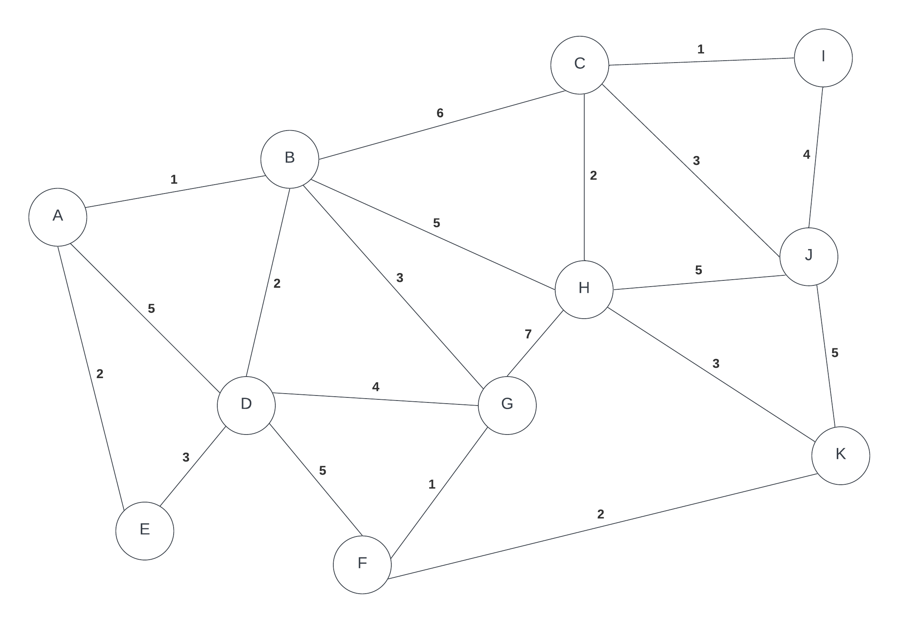

# Lab 4

This assessment contains materials that may be subject to copyright and other intellectual property rights. 

Modification, distribution or reposting of this document is strictly prohibited. Learners found reposting this document or its solution anywhere will be subject to the college’s Academic Integrity policy.

## Due: In class at the end of your lab period when this lab is assigned

In this lab you will look at how kruskal's and prim's algorithm works.

Use the following graph for both Kruskal's and Prim's

## Setup,

- Find a partner or two
- On the sheet of paper given to you write your name
- **Each person must submit their own sheet**
- label one side of paper as Kruskal's and the other side as Prim's
- show result of lab on appropriate side

## Kruskal's:

Using Kruskal's Algorithm, list the edges you in the order that they would be added in to form a Minimum Spanning Tree.   An edge is defined by the two vertices on either end of the edge.  Thus if you wanted to add the edge between vertices A and B,  use AB in your answer.  

## Prim's

Using Prim's algorithm, list the edges you would add in the order that they would be added to form a Minimum Spanning Tree using vertex A as the initial starting point. An edge is defined by the two vertices on either end of the edge.  Thus if you wanted to add the edge between vertices A and B,  use AB in your answer. 

## Reflection

- Write a short reflection on what you learned in the lab. Which algorithm did you prefer?

## Submitting your lab

In order to get a mark for this lab, you must submit:

* the lab sheet that is given to you at start of the lab at the end of the lab period

## Lab Rubric:

| Criteria       | Poor - 0 mark     | Fair - 1 marks                                                                                                                     | Good - 2 marks                                                              |
| -------------- | ----------------- | ------------------------------------------------------------------------------------------------------------------------------------ | --------------------------------------------------------------------------- |
| Lab Completion | Arrived in class to do lab more than 30 min late or  did not attend | Arrived in class to do lab more than 10 min late but less than 30 min late and/or Missing discussion | Arrived in class within the first 10 min of class and submitted work has a thorough discussion |
